<picture>
  <source media="(prefers-color-scheme: dark)" srcset="dark.svg">
  <source media="(prefers-color-scheme: light)" srcset="light.svg">
  
</picture>

 

 

## 🧑‍💻 About Me

- 🔭 Currently building **AI-powered web experiences**
- 🌱 Learning system design & advanced TypeScript patterns
- 💬 Ask me about React, Next.js, and modern frontend architecture
- ⚡ Fun fact: I debug better with coffee ☕

 

## 🛠️ Tech Stack

 

## 📊 GitHub Stats

 

## 🌐 Connect With Me

 

Built with pure SVG + SMIL — no JavaScript, no build step, 100% GitHub-native.

