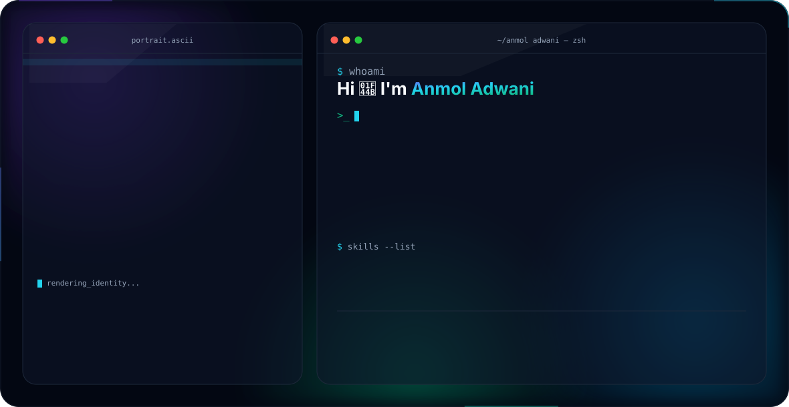

<div align="center">

<picture>
  <source media="(prefers-color-scheme: dark)" srcset="dark.svg">
  <source media="(prefers-color-scheme: light)" srcset="light.svg">
  
</picture>

<br>

<a href="https://git.io/typing-svg">
  
</a>

<br>

<a href="https://github.com/coolstack-coder">
  
</a>
<a href="https://github.com/coolstack-coder?tab=followers">
  
</a>
<a href="mailto:anmoladwani100@gmail.com">
  
</a>

</div>

<br>

```console
anmol@github:~$ whoami

AI engineer and full-stack developer from Jaipur, India.
I design intelligent products at the intersection of
language models, reliable software, and human decisions.

Current objective: build systems that are useful beyond the demo.
```

## `01. About`

I am pursuing a **B.Tech + M.Tech Dual Degree in Computer Science** at  
**The LNM Institute of Information Technology, Jaipur** — Class of 2028.

My work lives at the intersection of three questions:

- How can AI make complicated information easier to understand?
- How do we turn an experimental model into a dependable product?
- What separates an impressive prototype from software people actually use?

I enjoy building **GenAI applications, full-stack products, intelligent interfaces, and data-driven systems**. I am especially interested in applied NLP, LLM APIs, quantitative research, explainability, and product engineering.

> I do not want AI to merely generate more information.  
> I want it to make the next decision clearer.

<br>

## `02. Selected Builds`

<table>
<tr>
<td width="50%" valign="top">

### 🛡️ ClearTrade AI

A GenAI-powered investment-safety platform designed to help retail investors identify misinformation, suspicious market hype, and risky assets.

**Inside the system**

- AI-assisted risk profiling
- Portfolio risk analysis
- Market sentiment signals
- Misinformation detection
- Explainable investment insights

**Stack:** React · TypeScript · Flask · Python · Gemini · PostgreSQL

<br>

<a href="https://github.com/coolstack-coder/GEN-AI-clearTrade-AI">
  
</a>

</td>
<td width="50%" valign="top">

### ✦ Portfolio / Digital Playground

A motion-led personal portfolio built as an interactive editorial experience rather than a conventional developer template.

**Inside the experience**

- Responsive motion system
- Scroll-driven project storytelling
- Purposeful micro-interactions
- Accessible reduced-motion behavior
- Structured SEO metadata

**Stack:** React · TypeScript · Tailwind CSS · Framer Motion · Vite

<br>

<a href="https://github.com/coolstack-coder/Anmol_porfolio">
  
</a>

</td>
</tr>
</table>

<br>

## `03. Engineering Stack`

<div align="center">

<a href="https://skillicons.dev">
  
</a>

<br><br>


</div>

<br>

## `04. Current Operating System`

```yaml
name: Anmol Adwani
location: Jaipur, India
education:
  institute: The LNM Institute of Information Technology
  program: B.Tech + M.Tech in Computer Science
  graduation: 2028

building:
  - GenAI-powered web applications
  - explainable decision-support systems
  - full-stack product experiences

exploring:
  - applied NLP and LLM orchestration
  - quantitative research
  - reliable AI product engineering

principles:
  - ship the smallest useful system
  - make complexity feel simple
  - measure before optimizing
  - never hide uncertainty
```

<br>

## `05. GitHub Transmission`

<div align="center">


<br><br>


</div>

<br>

## `06. Contribution Arcade`

<div align="center">

<picture>
  <source
    media="(prefers-color-scheme: dark)"
    srcset="https://raw.githubusercontent.com/coolstack-coder/coolstack-coder/output/github-contribution-grid-snake-dark.svg"
  >
  <source
    media="(prefers-color-scheme: light)"
    srcset="https://raw.githubusercontent.com/coolstack-coder/coolstack-coder/output/github-contribution-grid-snake.svg"
  >
  
</picture>

<sub>Watch the snake consume the contribution graph. New level generated every day.</sub>

</div>

<br>

## `07. Establish Connection`

<div align="center">

**If you are building something ambitious with AI, data, or the web, let’s talk.**

<br>

<a href="https://www.linkedin.com/in/anmolaa100/">
  
</a>
<a href="mailto:anmoladwani100@gmail.com">
  
</a>
<a href="https://github.com/coolstack-coder">
  
</a>

<br><br>

```text
Ideas are cheap.
Clarity is rare.
Execution is the signal.
```

<sub>Designed with intent. Built by Anmol Adwani.</sub>

</div>
